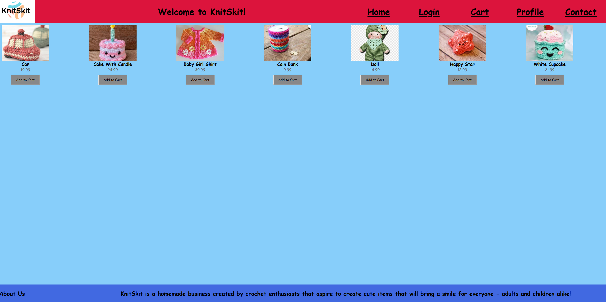
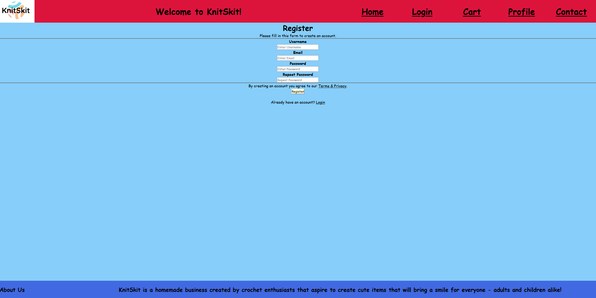
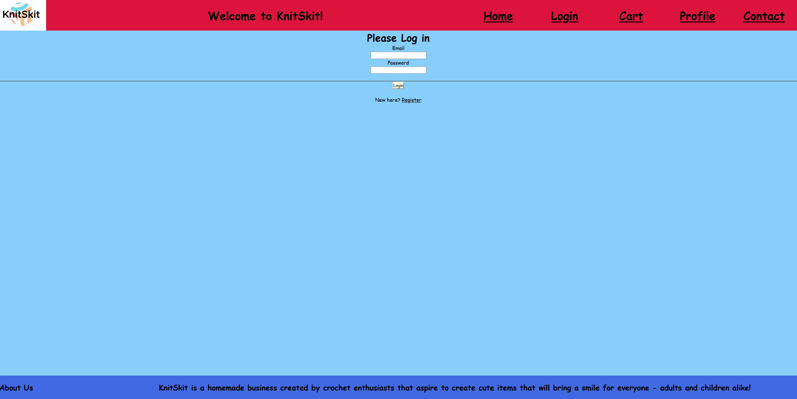
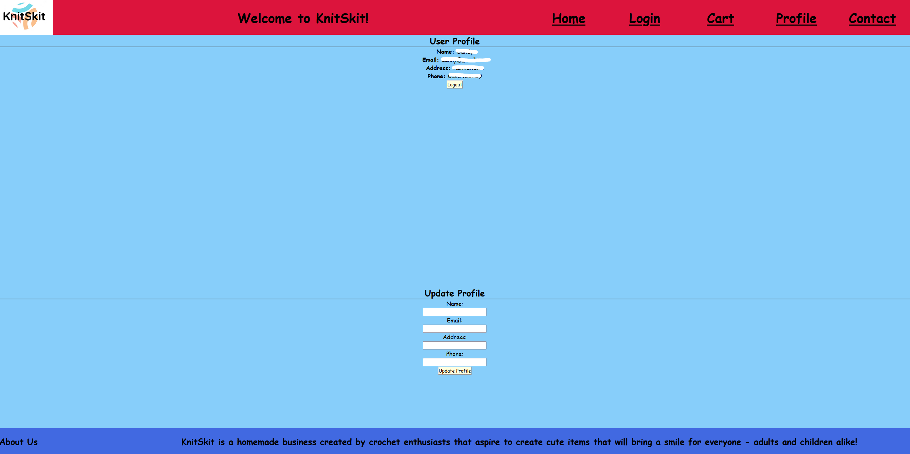
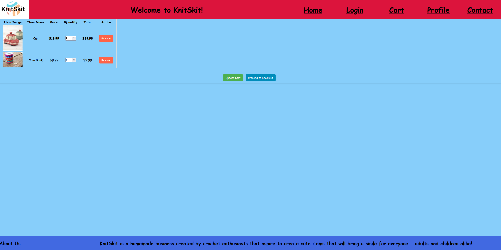
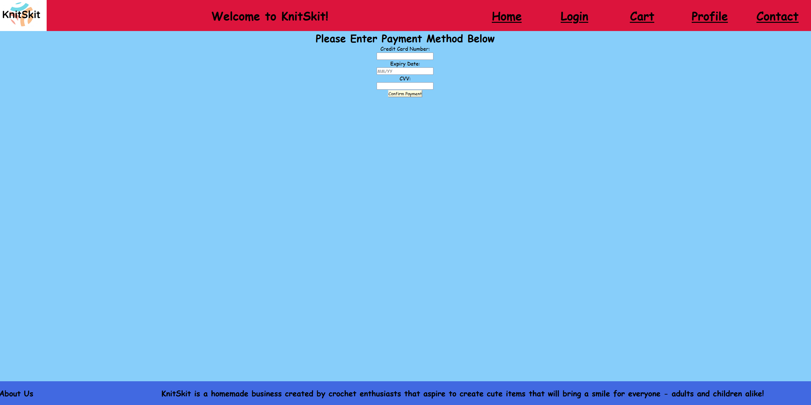
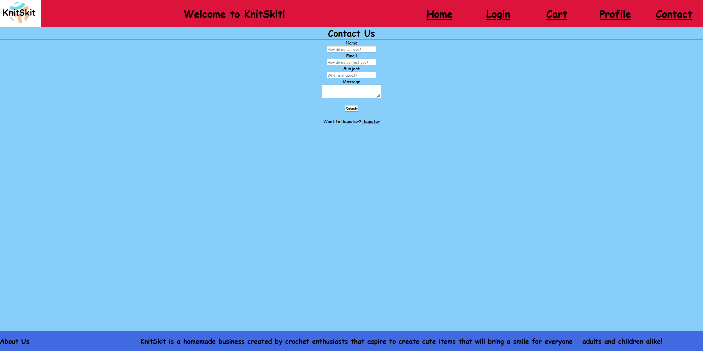

# KnitSkit

KnitSkit is a dynamic website crafted with HTML, CSS, and JavaScript by Danny and Tomer. It offers a seamless shopping experience, allowing users to explore items, add them to a cart, and manage their selections in real-time.

## Site Overview

This project implements the server-side functionality to the client-side, which lets potential customers view items, and buy them if they wish, after creating a user.

## Detailed Implementation:

1. **Project Folder Structure**

   The project follows a structured folder organization:

    - **Components:** Contains shared components like the header.
    - **Pages:** Each page has its own folder with static assets, HTML templates, and Python file.
    - **Static:** Contains folders for general CSS and JavaScript files.
    - **Templates:** HTML files, including the base template for the website.
    
    - Additional files are:
      - `db_connector.py` - for connecting to the database
      - `settings.py` - for the connection settings
      - `app.py` - for the pages and their functionalities

2. **Handling Routing Client Requests**

   Functions are created to handle client requests.

3. **Connection to Database and SQL Queries**

   The project uses a MongoDB database with collections for users, products and carts.

4. **Implementation of Forms**

   Forms are implemented to handle user input.
   Forms interact with the database for operations like selecting and adding information.

5. **Translation of HTML Pages into Templates**

   HTML pages are converted into templates to enable dynamic content rendering based on user inputs.

## Features

**Register:**
- After registering, users will be directed to the login screen to access their new account.
- Users can update their profile information after registering and logging in, in the Profile page.

**Login:**
- Users can log in using password and email.
- Upon clicking the login button, users will be redirected to the Home Page.

**Profile:**
- Users can view and update their profile.
- Without an address and phone number, purchases cannot be made (no delivery information).

**Home:**
- This page showcases the item selection the store has to offer. Users can browse through various items and add them to their cart.

**Cart:**
- The cart is enabling users to view the items added to their cart, adjust the quantity of the items, remove items if they changed their minds and continue to checkout.

**Contact Page:**
- Users can leave a message via the contact page.

## Order of Operations:

1. **Home page:** Users first land on the home screen and can view items.
2. **Register/Login pages:** Users can register or log in if they want to make a purchase.
3. **Profile page:** After logging in, users might have to add a phone number and address for the delivery of the items they wish to buy.
4. **Cart page:** Users can view their cart at any time, and can proceed to finish the order from there.
5. **Checkout page:** After confirming their cart and delivery information, users can enter Credit Card information to finish the order.
6. **Contact page:** If anyone has any question about the site or its owners, they can contact the relevant people through the Contact page.

## Screenshots:

- **Home Page:**
  

- **Register Page:**
  

- **Login Page:**
  

- **Profile Page:**
  

- **Cart Page:**
  

- **Checkout Page:**
  

- **Contact Page:**
  
